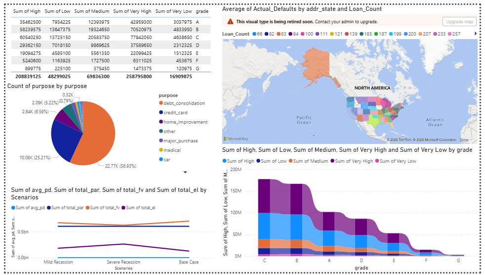
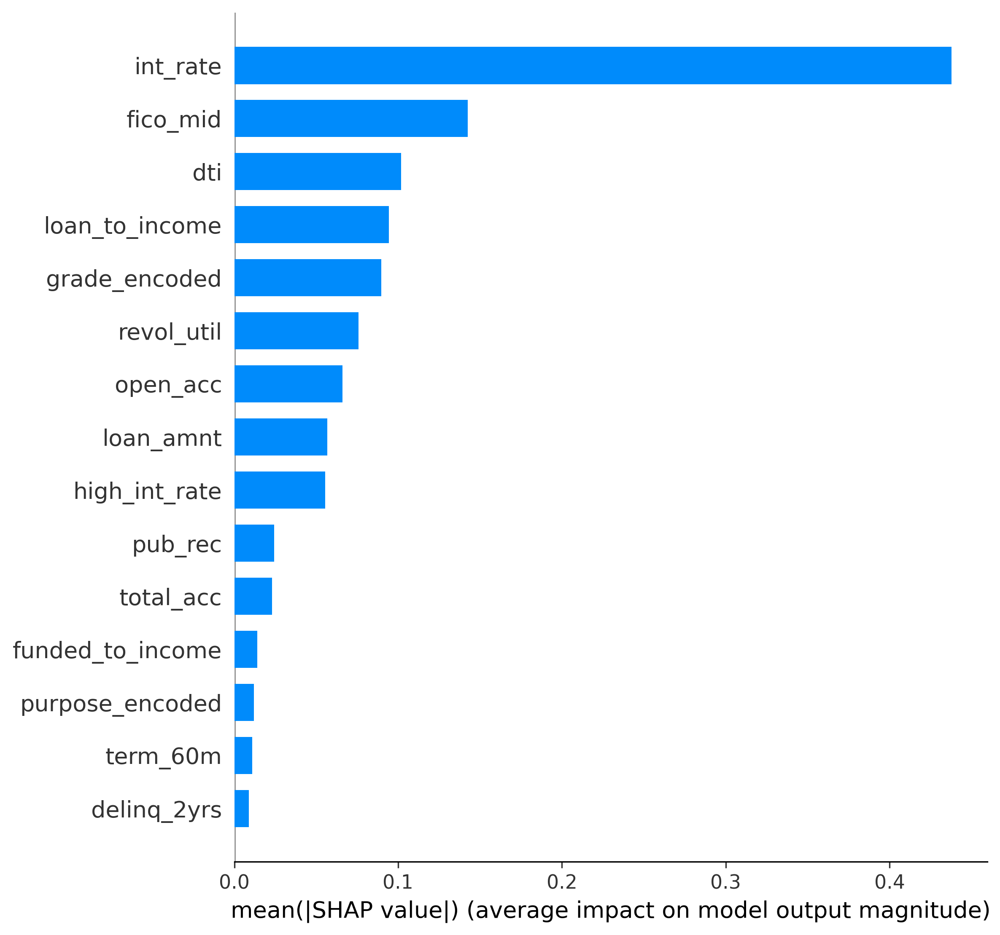

# Private Credit Risk & Fair Value Estimator
> An end-to-end quantitative finance pipeline that automates Portfolio Valuation workflows — from raw loan data to stress-tested fair value reporting — built on the same tools and concepts used by alternative asset managers.

**Author:** Bhargavi Naik | [LinkedIn](https://www.linkedin.com/in/naikbhargavi05/) | [GitHub](https://github.com/bvnaik05)

## Dashboard Overview on PowerBI
---



---

## Table of Contents
- [Overview](#overview)
- [Why This Project](#why-this-project)
- [Pipeline Architecture](#pipeline-architecture)
- [Tech Stack](#tech-stack)
- [Project Structure](#project-structure)
- [Phase Breakdown](#phase-breakdown)
- [Key Results](#key-results)
- [Model Explainability — SHAP](#model-explainability--shap)
- [Stress Testing](#stress-testing)
- [Domain Context](#domain-context)
- [How to Run](#how-to-run)

---

## Overview

This project builds a **four-phase quantitative pipeline** that mirrors what Portfolio Valuation teams at alternative asset managers perform every quarter:

1. **Ingest & warehouse** loan-level data in Snowflake
2. **Engineer financial features** — debt ratios, FICO bands, delinquency flags — and prepare ML-ready datasets
3. **Train an XGBoost classifier** to predict Probability of Default (PD) for each loan, with full SHAP explainability
4. **Price every loan** using a risk-adjusted fair value model and run three-scenario stress testing (Base, Mild Recession, Severe Recession)

The outputs feed directly into a **Power BI dashboard** with six data tables, enabling portfolio managers to monitor risk exposure, fair value vs. par, and NAV sensitivity — exactly as required under **ASC 820 fair value reporting standards**.

---

## Why This Project

Portfolio Valuation teams at firms like Houlihan Lokey perform this workflow manually every quarter across hundreds of funds. The core challenge:

- Private loans have **no active market quotations** — fair value must be modelled, not observed
- Default risk varies enormously by borrower characteristics — grade, FICO, DTI, delinquency history
- Fund NAV is sensitive to macroeconomic shocks — recession scenarios must be pre-computed and defensible to auditors

This project automates that entire workflow end-to-end using the same tools the industry uses: **Snowflake** for data warehousing, **XGBoost** for credit risk modelling, and **Power BI** for client-facing reporting.

---

## Pipeline Architecture

```
┌─────────────────────────────────────────────────────────────────┐
│                        DATA LAYER                               │
│  Lending Club (200k loans) ──► Snowflake (LOANS_RAW table)     │
└─────────────────────────┬───────────────────────────────────────┘
                          │
┌─────────────────────────▼───────────────────────────────────────┐
│                   FEATURE ENGINEERING                           │
│  Debt-to-Income · FICO mid · Loan-to-Income · Delinquency Flag  │
│  Grade Encoding · Home Ownership OHE · Term Binary              │
└─────────────────────────┬───────────────────────────────────────┘
                          │
          ┌───────────────┴───────────────┐
          │                               │
┌─────────▼──────────┐         ┌──────────▼──────────┐
│  MODEL A           │         │  MODEL B             │
│  XGBoost Classifier│         │  Fair Value Engine   │
│  → PD score (0–1)  │         │  → DCF pricing       │
│  → SHAP values     │         │  → Expected Loss     │
└─────────┬──────────┘         └──────────┬───────────┘
          └───────────────┬───────────────┘
                          │
┌─────────────────────────▼───────────────────────────────────────┐
│                      OUTPUT LAYER                               │
│  Power BI Dashboard · Stress Test Scenarios · Excel Reports     │
│  6 datasets: loan_portfolio · by_grade · by_state · kpis ·     │
│              stress_scenarios · risk_matrix                     │
└─────────────────────────────────────────────────────────────────┘
```

---

## Tech Stack

| Layer | Tools | Purpose |
|---|---|---|
| Data Warehouse | Snowflake (AWS Mumbai) | Store and query 200k loan records |
| Data Processing | Python, pandas, NumPy | Cleaning, feature engineering, exports |
| ML Modelling | XGBoost, scikit-learn | Probability of Default classification |
| Explainability | SHAP | Feature-level model interpretability |
| Valuation | Custom DCF engine (Python) | Risk-adjusted fair value per loan |
| Visualization | Power BI Desktop | Portfolio dashboard and stress testing |
| Version Control | Git, GitHub | Full project history |
| Environment | Python 3.12, venv | Reproducible environment |

---

## Project Structure

```
private-credit-valuator/
│
├── notebooks/
│   └── 01_eda.ipynb                     # Exploratory data analysis
│
├── src/
│   ├── snowflake_connect.py             # Snowflake connection manager
│   ├── load_to_snowflake.py             # Raw data ingestion pipeline
│   ├── setup_schema.py                  # Database and table creation
│   ├── phase1_report.py                 # Data validation & EDA (SQL-driven)
│   ├── phase2_feature_engineering.py    # Feature engineering & ML data prep
│   ├── phase3_xgboost_model.py          # XGBoost PD model training & eval
│   └── phase4_fair_value_engine.py      # DCF valuation & stress testing
│
├── snowflake/
│   └── schema.sql                       # LOANS_RAW table definition
│
├── outputs/
│   ├── plots/
│   │   ├── roc_curve_*.png              # ROC curve (AUC = 0.7055)
│   │   ├── confusion_matrix_*.png       # Confusion matrix
│   │   ├── prob_distribution_*.png      # PD score distribution
│   │   ├── shap_summary_*.png           # SHAP global feature importance
│   │   ├── shap_dependence_int_rate_*.png
│   │   ├── shap_dependence_grade_*.png
│   │   └── shap_dependence_high_int_rate_*.png
│   ├── PHASE1_Data_Report.xlsx          # Full EDA report (9 sheets)
│   └── powerbi_image.png               # Dashboard screenshot
│
├── powerbi/
│   └── Private_Credit_Valuation.pbix    # Power BI dashboard file
│
├── .gitignore
├── requirements.txt
└── README.md
```

---

## Phase Breakdown

### Phase 1 — Data Ingestion & Validation
- Downloaded **2.2M real loan records** from Lending Club (2007–2018)
- Selected 21 credit-relevant fields and loaded **200,000 loans** into Snowflake (`LOANS_RAW`)
- Built a SQL-driven validation report covering: data quality, null rates, FICO band analysis, DTI distribution, default rates by grade and purpose
- Exported a **9-sheet Excel report** for audit trail

**Key finding:** Baseline default rate of **17.9%** — consistent with historical sub-investment grade portfolios

---

### Phase 2 — Feature Engineering
- Pulled data from Snowflake into Python and engineered **17 ML-ready features**
- Financial ratios built: `loan_to_income`, `funded_to_income`, `fico_mid`, `has_past_delinquency`
- Categorical encoding: ordinal for grade (A=1 → G=7), one-hot for home ownership, top-8 label encoding for loan purpose
- Applied **stratified 80/20 train/test split** to preserve the 17.9% default rate in both sets
- Normalized with `StandardScaler` and saved all artifacts (scaler, feature names, split data) for reproducibility

---

### Phase 3 — XGBoost Default Prediction Model
- Trained **XGBoost classifier** with `scale_pos_weight` to handle class imbalance (82:18 ratio)
- Key hyperparameters: `max_depth=6`, `learning_rate=0.05`, `n_estimators=200`, `subsample=0.8`
- Generated SHAP values for full model explainability — every prediction can be audited at feature level

**Model Performance:**

| Metric | Value |
|---|---|
| Test AUC-ROC | **0.7055** |
| Train AUC-ROC | 0.7372 |
| Recall | 67.53% |
| Precision | 28.29% |
| Overfitting Gap | 0.032 (minimal — model generalises well) |

> **Why recall matters more than precision here:** In credit risk, missing a defaulter (false negative) is more costly than flagging a healthy loan for review (false positive). A recall of 67.5% means the model catches 2 out of every 3 actual defaults — appropriate for a risk management use case.

---

### Phase 4 — Fair Value Engine & Stress Testing
- Built a **risk-adjusted fair value model** per loan:
  - PD from XGBoost model
  - LGD computed dynamically by loan grade (A=25% → G=85%), home ownership, and DTI
  - Fair value = risk-adjusted principal recovery + survival-weighted interest income
- Computed **Expected Loss (EL = PD × LGD × Loan Amount)** for every loan
- Ran **three macro stress scenarios** with multipliers on PD, LGD, and interest rates
- Exported **6 Power BI datasets**: loan-level portfolio, by-grade summary, by-state summary, KPIs, stress scenarios, risk matrix

---

## Key Results

| Metric | Value |
|---|---|
| Dataset | 200,000 Lending Club loans (2007–2018) |
| Default Rate (Actual) | 17.9% |
| Model AUC-ROC | **0.7055** |
| Model Recall | **67.53%** — catches 2 in 3 defaulters |
| Portfolio Par Value | $602.68M |
| Portfolio Fair Value | $702.23M |
| Mark-to-Market Gain | **+$99.55M (+16.5%)** |
| Total Expected Loss | $127.26M |
| Mild Recession NAV Impact | **-$31.39M (-4.5%)** |
| Severe Recession NAV Impact | **-$78.58M (-11.2%)** |
| Portfolio Avg PD | 45.22%* |
| Portfolio Avg LGD | 46.28% |

> *Avg PD of 45% reflects the test set composition (2016–2018 vintage loans at peak default cycle). A production implementation would sample across vintages for a representative portfolio.

---

## Model Explainability — SHAP

SHAP (SHapley Additive Explanations) makes every prediction auditable — critical for regulated financial firms where model decisions must be defensible to auditors and regulators.

**SHAP Summary Plot** shows global feature importance across all test loans:



**SHAP Dependence Plots** show how individual features drive default probability:

| Feature | Finding |
|---|---|
| `int_rate` | Higher interest rate → higher PD (captures lender's risk premium) |
| `grade_encoded` | Grade G loans have 3–4× higher SHAP values than Grade A |
| `high_int_rate` | Binary flag amplifies risk for loans above median rate |

This level of explainability mirrors what HL's **Ingest AI** provides — traceability from input data to valuation output.

---

## Stress Testing

Three scenarios applied to the full portfolio simultaneously:

| Scenario | PD Multiplier | LGD Increase | Rate Increase | NAV Impact |
|---|---|---|---|---|
| Base Case | 1.0× | — | — | — |
| Mild Recession | 1.3× | +10% | +10% | **-$31.39M (-4.5%)** |
| Severe Recession | 1.8× | +25% | +25% | **-$78.58M (-11.2%)** |

These scenarios are directly comparable to stress tests performed for ASC 820 fair value reporting and Fed stress testing frameworks (DFAST/CCAR).

---

## Domain Context

| Term | Definition |
|---|---|
| **PD** | Probability of Default — likelihood a borrower stops making payments |
| **LGD** | Loss Given Default — % of loan amount lost if default occurs (after recovery) |
| **EL** | Expected Loss = PD × LGD × Exposure — the actuarial cost of credit risk |
| **Fair Value** | Present value of risk-adjusted future cash flows — not the same as par value |
| **ASC 820** | US GAAP standard requiring funds to report investments at fair value quarterly |
| **Mark-to-Market** | Difference between fair value and par (book) value of a loan |
| **NAV** | Net Asset Value — total portfolio fair value, the number fund managers report to investors |

---

## How to Run

**1. Clone the repo and set up environment**
```bash
git clone https://github.com/bvnaik05/private-credit-valuator.git
cd private-credit-valuator
python -m venv venv
venv\Scripts\activate        # Windows
pip install -r requirements.txt
```

**2. Configure Snowflake credentials**
```bash
# Create .env file in project root
SNOWFLAKE_USER=your_username
SNOWFLAKE_PASSWORD=your_password
SNOWFLAKE_ACCOUNT=your_account_identifier
SNOWFLAKE_WAREHOUSE=COMPUTE_WH
SNOWFLAKE_DATABASE=HL_CREDIT_RISK
SNOWFLAKE_SCHEMA=PUBLIC
```

**3. Download data**

Download `accepted_2007_to_2018Q4.csv.gz` from [Kaggle — Lending Club](https://www.kaggle.com/datasets/wordsforthewise/lending-club) and place in `data/`

**4. Run the pipeline in order**
```bash
python src/setup_schema.py                  # Create Snowflake tables
python src/load_to_snowflake.py             # Ingest 200k loans
python src/phase1_report.py                 # Data validation report
python src/phase2_feature_engineering.py    # Feature engineering
python src/phase3_xgboost_model.py          # Train XGBoost model
python src/phase4_fair_value_engine.py      # Fair value + stress test
```

**5. Open Power BI dashboard**

Import the 6 CSV files from `data/powerbi/` into `powerbi/Private_Credit_Valuation.pbix`
